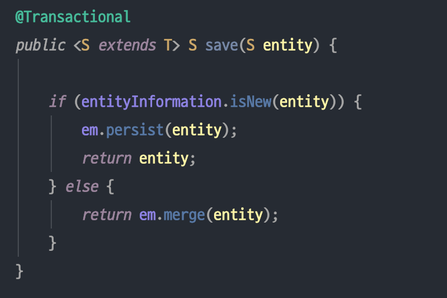
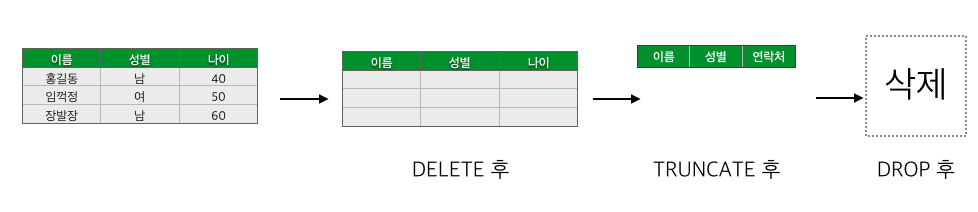

# 목차
- [JPA,Hibernate,data Jpa 차이](#jpa-hibernate-data-jpa-차이)
  * [Jpa 는 기술 명세이다.](#jpa-는-기술-명세이다)
  * [Hibernate 는 JPA의 구현체이다.](#hibernate-는-jpa의-구현체이다)
  * [Spring Data JPA 는 JPA 를 쓰기 편하게 만들어 놓은 모듈이다.](#spring-data-jpa-는-jpa-를-쓰기-편하게-만들어-놓은-모듈이다)
  * [요약](#요약)
- [junit 의 @Runwith](#junit-의-runwith)
- [application context](#application-context)
- [FK 가 있는 테이블의 TURNCATE 하는 법](#fk-가-있는-테이블의-turncate-하는-법)
- [DROP vs TURNCATE](#drop-vs-turncate)
- [@sql](#sql)
- [@After](#after)
- [jpa application.properties 설정](#jpa-applicationproperties-설정)
  * [실제로 실행된 쿼리를 확인하는 방법](#실제로-실행된-쿼리를-확인하는-방법)
  * [쿼리 로그를 Mysql 문법으로 변경하는 방법](#쿼리-로그를-mysql-문법으로-변경하는-방법)
  * [콘솔에 출력되는 JPA 실행 쿼리를 가독성있게 표현하는 방법](#콘솔에-출력되는-jpa-실행-쿼리를-가독성있게-표현하는-방법)
  * [디버깅이 용이하도록 SQL문 이외에 추가적인 정보를 출력해주는 방법](#디버깅이-용이하도록-sql문-이외에-추가적인-정보를-출력해주는-방법)
## JPA,Hibernate,data Jpa 차이
### Jpa 는 기술 명세이다.
- Jpa 는 Java Persistence API 의 약자로, 자바 어플리케이션에서 **관계형 데이터베이스를 사용하는 방식을 정의한 인터페이스이다.**
여기서 중요하게 여겨야 할 부분은, JPA는 말 그대로 **인터페이스**라는 점이다. JPA는 특정 기능을 하는 **라이브러리**가 아니다. 
마치 일반적인 백엔드 API가 클라이언트가 어떻게 서버를 사용해야 하는지를 정의한 것처럼, 
JPA 역시 자바 어플리케이션에서 관계형 데이터베이스를 어떻게 사용해야 하는지를 정의하는 한 방법일 뿐이다.

- JPA는 단순히 명세이기 때문에 구현이 없다. JPA를 정의한 `javax.persistence` 패키지의 대부분은 `interface`, `enum`, `Exception`, 그리고 각종 `Annotation`으로 이루어져 있다. 
예를 들어, JPA의 핵심이 되는 `EntityManager`는 아래와 같이 `javax.persistence.EntityManager` 라는 파일에 `interface`로 정의되어 있다.
    ```java
    package javax.persistence;
    import ...

    public interface EntityManager {

    public void persist(Object entity);

    public <T> T merge(T entity);

    public void remove(Object entity);

    public <T> T find(Class<T> entityClass, Object primaryKey);

    // More interface methods...
    }
   ```
### Hibernate 는 JPA의 구현체이다.
- Hibernate는 **JPA라는 명세의 구현체**이다. 즉, 위에서 언급한 `javax.persistence.EntityManager`와 같은 인터페이스를 직접 구현한 라이브러리이다. 
**JPA와 Hibernate는 마치 자바의 interface와 해당 interface를 구현한 class**와 같은 관계이다.


- 위 사진은 JPA와 Hibernate의 상속 및 구현 관계를 나타낸 것이다. JPA의 핵심인 `EntityManagerFactory`, `EntityManager`, 
`EntityTransaction`을 Hibernate에서는 각각 `SessionFactory`, `Session`, `Transaction`으로 상속받고 각각 `Impl`로 구현하고 있음을 확인할 수 있다.

- “Hibernate는 JPA의 구현체이다”로부터 도출되는 중요한 결론 중 하나는 **JPA를 사용하기 위해서 반드시 Hibernate를 사용할 필요가 없다는 것이다.**
Hibernate의 작동 방식이 마음에 들지 않는다면 언제든지 DataNucleus, EclipseLink 등 다른 JPA 구현체를 사용해도 되고, 
심지어 본인이 직접 JPA를 구현해서 사용할 수도 있다. 다만 그렇게 하지 않는 이유는 단지 Hibernate가 굉장히 성숙한 라이브러리이기 때문일 뿐이다.

### Spring Data JPA 는 JPA 를 쓰기 편하게 만들어 놓은 모듈이다.
- Spring으로 개발하면서 단 한 번도 `EntityManager`를 직접 다뤄본 적이 없다. DB에 접근할 필요가 있는 대부분의 상황에서는 `Repository`를 정의하여 사용했다.
아마 다른 분들도 다 비슷할 것이라 생각한다. 이 `Repository`가 바로 Spring Data JPA의 핵심이다.
- Spring Data JPA는 Spring에서 제공하는 모듈 중 하나로, 개발자가 JPA를 더 쉽고 편하게 사용할 수 있도록 도와준다.
이는 **JPA를 한 단계 추상화시킨 Repository라는 인터페이스를 제공함으로써 이루어진다.** 사용자가 `Repository` 인터페이스에 정해진 규칙대로 메소드를 입력하면, 
Spring이 알아서 해당 메소드 이름에 적합한 쿼리를 날리는 구현체를 만들어서 Bean으로 등록해준다.
- Spring Data JPA가 JPA를 추상화했다는 말은, **Spring Data JPA의 `Repository`의 구현에서 JPA를 사용하고 있다**는 것이다.
예를 들어, Repository 인터페이스의 기본 구현체인 `SimpleJpaRepository`의 코드를 보면 아래와 같이 내부적으로 EntityManager을 사용하고 있는 것을 볼 수 있다.
    ```java
    package org.springframework.data.jpa.repository.support;
    
    import ...
    
    public class SimpleJpaRepository<T, ID> implements JpaRepositoryImplementation<T, ID> {
    
        private final EntityManager em;
    
        public Optional<T> findById(ID id) {
    
            Assert.notNull(id, ID_MUST_NOT_BE_NULL);
    
            Class<T> domainType = getDomainClass();
    
            if (metadata == null) {
                return Optional.ofNullable(em.find(domainType, id));
            }
    
            LockModeType type = metadata.getLockModeType();
    
            Map<String, Object> hints = getQueryHints().withFetchGraphs(em).asMap();
    
            return Optional.ofNullable(type == null ? em.find(domainType, id, hints) : em.find(domainType, id, type, hints));
        }
    
        // Other methods...
    }
    ```
### 요약
- jpa 를 이용하면 entityManager 을 우리가 직접 사용해야한다.
예를들어 아래와 같이 사용해야한다.

같은 교육을 받고 있는 교육생이 쉽게 설명을 해주었다.
```gherkin
Repository 로 사용하는 save는 직관적임 -> spring data jpa 

raw jpa를 사용했다면 save 같은 기능을 구현한다면,
		if (entityInformation.isNew(entity)) {
			em.persist(entity);
			return entity;
		} else {
			return em.merge(entity);
		}

라는 식으로 사용했어야 한다, (새로운 entity 면(새로운) persist, 새로운 entity가 아니면(헌 것) merge)
```
```java
//spring data jpa를 사용한다.
//repository.find() 를 사용한다.
class Repository<ID,T> {
    EntityManager em;

    T find() {
    // jpa의 entityManager를 사용해서 find를 한다.
	return em.find();
    }
}
```
- 정리
    - jpa 명세를 구현해놓은 hibernate 가 있고 jpa 를 날 것으로 쓰면 불편하니까 
    한번 더 추상한 spring data jpa 로 직관적으로 모듈로서 이용한다.
      

[참고](https://suhwan.dev/2019/02/24/jpa-vs-hibernate-vs-spring-data-jpa/)

## junit 의 @Runwith
- JUnit 의문 JUnit을 실행하면서, 테스트 메소드는 클래스의 객체가 생성이 되지도 않았는데 어떻게 실행을 해줄까? 
    - 해답은 Test Runner(테스트 러너) JUnit 프레임워크는 테스트 클래스 내에 존재하는 각각의 테스트 메소드 실행을 담당하고 있는 클래스를 Test Runner 라고 한다.
     이 테스트 러너는 테스트 클래스의 구조에 맞게 테스트 메소드들을 실행하고 결과를 표시하는 역할을 수행. 기본적으로 JUnit에 내장된 BlockJUnit4ClassRunner 라는 테스트 러너 클래스가 실행.
     또한, @RunWith 어노테이션을 통해서 BlockJUnit4ClassRunner 대신에 다른 클래스를 지정해서 테스트 메소드들을 수행하도록 지정도 가능하다. 
     예시) @RunWith(SpringJUnit4ClassRunner.class) -> 스프링 예제코드에서 테스트 코드 작성시, 이렇게 지정한걸 볼수가 있다. 이런식으로 지정을 하면 기본 러너를 상속 받고, 자신만의 테스트 기능을 추가해서 사용한다고 생각하면 된다

- 그리고 해당 해당 어노테이션을 JUnit4에서는 @SpringBootTest 와 같이 써주어야 하는데 다음과 같은 글을 볼 수 있었다. Junit5 부턴 RunWith 를 명시하지 않아도 된다.

```gherkin
If you are using JUnit 4, don’t forget to also add @RunWith(SpringRunner.class) to your test, otherwise the annotations will be ignored. 
☞ Junit4 사용시 @SpringBootTest 기능은 반드시 JUnit의 SpringJUnit4ClassRunner 클래스를 상속 받는 @RunWith(SpringRynnver.class)와 함께 사용해야 한다. 
  
If you are using JUnit 5, there’s no need to add the equivalent @ExtendWith(SpringExtension.class) as @SpringBootTest  
and the other @…Test annotations are already annotated with it. 
☞ Junit5 사용시에는 해당 어노테이션은 명시할 필요없다.

출처: https://goddaehee.tistory.com/211 [갓대희의 작은공간]
```
[출처](https://www.inflearn.com/questions/16133)

## application context
- [application context](https://ict-nroo.tistory.com/120)

## FK 가 있는 테이블의 TURNCATE 하는 법
- [FK 가 있는 테이블의 TURNCATE 하는 법1](https://wookmania.tistory.com/113)
- [FK 가 있는 테이블의 TURNCATE 하는 법2](http://database.sarang.net/?inc=read&aid=9917&criteria=pgsql&subcrit=&id=&limit=20&keyword=&page=1)
    - 서로 연관되어있는 테이블이라 turncate 가 되지 않
- [stackOverflow](https://stackoverflow.com/questions/5452760/how-to-truncate-a-foreign-key-constrained-table/5452798#5452798)

## DROP vs TURNCATE
- [DROP vs TURNCATE](https://goddaehee.tistory.com/55)
    - DROP 은 `DML` 이고 TURNCATE 는 `DDL` 이다.
    - DELETE 후에는 데이터만 지워지고 쓰고 있던 디스크 상의 공간은 그대로 가지고 있습니다.
    TRUNCATE 작업은 최초 테이블이 만들어졌던 상태, 즉 데이터가 1건도 없는 상태로 모든데이터 삭제, 칼럼값만 남아 있습니다.
    그리고 용량도 줄고 인덱스 등도 모두 삭제 됩니다.
      
    **DELETE보다 TRUNCATE가 더 좋아 보이나 DELETE는 원하는 데이터만 골라서 삭제가 가능하나 TRUNCATE는 그렇지 못합니다.**
    DROP 명령어는 데이터와 테이블 전체를 삭제하게 되고 
    사용하고 있던 공간도 모두 반납하고 인덱스나 제약조건 등 오브젝트로 삭제 됩니다.
      
    [출처](https://lee-mandu.tistory.com/476)    
- 오라클 커뮤니티에 좋은 답변이 있어서 가져 왔다.
```gherkin
옛날 forum에 stmlyhl님께서 올리셨던 글인데 달리 더 드릴 말씀이 없으므로 인용하여 드립니다.

DROP : 테이블의 정의 자체를 완전히 삭제함. (DML)
Rollback 불가능. 
테이블이 사용했던 Storage를 모두 Release 

Delete : 데이터만 삭제. 
Commit이전에는 Rollback이 가능함. 
데이터를 모두 Delete해도 사용했던 Storage는 Release되지 않음. 

Truncate : 테이블을 최초 생성된 초기상태로 만듬. (DML)
Rollback 불가능. 
테이블이 사용했던 Storage중 최초 테이블 생성시 할당된 
Storage만 남기고 Release. 

가령 TB_A라는 테이블이 INITIAL EXTENT가 1M, NEXT EXTENT가 1M, 
MIN_EXTENTS = 1 이고 데이터가 늘어나 현재 EXTENT가 1500개라면 
현재 이 테이블이 보유하고 있는 Storage 1.5GB인데 데이터를 모두 Delete 
하면 건수는 0 이지만 Storage는 그대로 1.5GB입니다. 
그러나 Truncate를 하면 테이블의 최초 생성상태인 1MB로 Storage가 줄어들게 되지요.
```
이해가 가지 않는 다면 [여기](https://reoim.tistory.com/entry/Oracle-DELETE-TRUNCATE-and-DROP-차이점과-주의점)를 확인하자

## @sql
- @Sql에 명시한 파일은 테스트를 실행하는데 적합한 상태로 DB를 초기화하기 위해 DELETE, TRUNCATE, INSERT, CREATE와 같은 쿼리를 포함하게 된다.
  클래스에 @Sql 애노테이션을 적용하면 **각 테스트 메서드마다 적용**되며, 테스트 메서드에 적용하면 해당 테스트를 실행할 때에만 사용된다. 
  
  [출처](https://javacan.tistory.com/entry/spring41-AtSql-annotation-intro)

## @After
- Junit 에서 단위 테스트가 끝날 때마다 수행되는 메소드를 지정
- 보통 배포 전 전체 테스트를 수행할 때 테스트간 데이터 침법을 막기 위해 사용한다. 
    - @sql 을 이용해서 지금처럼 turncate 를 이용해도 된다.
- 여러 테스트가 동시에 수행되면 테스트용 DB 인 H2에 데이터가 그대로 남아 있어 다음 테스트 실행 시 테스트가 실패 할 수 있다.
    - 별 다른 설정 없이 @SpringBootTest 를 사용할 경우 H2를 자동으로 실행한다.

## jpa application.properties 설정

### 실제로 실행된 쿼리를 확인하는 방법
- 쿼리 로그를 java class로 구현할 수 있으나 spring boot 에서는 application.properties, application.yml 등의 
**파일 한줄의 코드**로 설정할 수 있도록 지원하고 권장하고 있다.
    - spring.jpa.show_sql=true

### 쿼리 로그를 Mysql 문법으로 변경하는 방법
- 위의 설정을 하고나서 로그를 확인해 보면 create table 쿼리를 보면
```h2
create table posts (
id bigint generated by default as identity, 
author varchar(255), 
content TEXT not null,
title varchar(500) not null,
primary key (id))
```
로 생성이 되는 것을 볼 수 있다. 이는 H2 문법이 적용 되어서 그런건데 H2는 Mysql 쿼리를 수행해도
정상적으로 작동하기 때문에 **출력되는 쿼리 로그를 Mysql 버전으로 변경하자.**
쿼리를 날릴때 database 를 dialect 으로 쉽게 변경할 수 있다. 지금 h2를 쓰고있지만 mysql 쿼리도 h2가 수행하므로 
알아보기 쉽게 mysql 쿼리를 hibernate 가 보내도록 변경함
- spring.jpa.properties.hibernate.dialect=org.hibernate.dialect.MySQL5InnoDBDialect
    
    [dialect 이란](https://jacojang.github.io/jpa/java/hibernate/2016/11/20/jpa-chapter2-persistence-xml.html)

### 콘솔에 출력되는 JPA 실행 쿼리를 가독성있게 표현하는 방법
- spring.jpa.properties.hibernate.format_sql=true

### 디버깅이 용이하도록 SQL문 이외에 추가적인 정보를 출력해주는 방법
- spring.jpa.properties.hibernate.use_sql_comments=true

